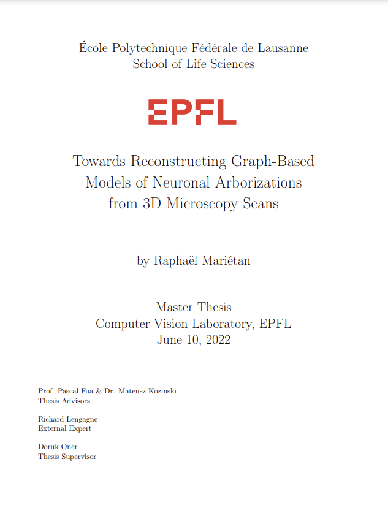

# Towards Reconstructing Graph-Based Models of Neuronal Arborizations from 3D Microscopy Scans

This repository contains the implementation of my Master thesis at EPFL described in the [project report](res/thesis_final_report.pdf). The implementation code is private and has not been publicly released so all the scripts are left empty on this repository.

 

 

## Abstract :

Reconstruction of neuron morphologies has been a longstanding challenge for the computer
vision community. The broad spectrum of its applications, ranging from providing more
accurate neuron simulation models to neurological disorders identification, highlights the
multidisciplinary aspect of this research topic and its significant potential to help science
move forward. Considerable effort has been put towards developing tools that can reduce
the excessive amount of manual input that has to be provided to complete a reconstruction.
However, current methods have struggled to revolutionize the field, mostly failing to keep
the tree topology of the reconstructions nor providing the output in the form of a graph,
preferred for many uses.
To this end, we propose a new approach to the neuron tracing problem that can be
generalized to other applications such as vasculature and road network extraction. The
designed method outputs a graph-based reconstruction, which provides branch-specific
information, extracts the bifurcation points and preserves the tree structure of the reconstructed neuron. We design a model that can easily be integrated
to an annotation pipeline, in which a Reinforcement Learning agent is trained to navigate through neuron images and trace the underlying branch trajectories. We show that
the proposed approach can be adapted to work on synthetic data, first by applying in
two dimensions, and then by demonstrating its applicability to neuronal structures in
three dimensions. The approach is finally tested on predictions coming from real neuron
microscopy scans. The agent is able to move along neurites on real data, but missing
information and significant gaps in the annotations expose the need for more accurate
annotations for the complete assessment of the applicability of the proposed approach to
real data use cases.

## Example of an animated reconstruction on a small synthetic 3D neuron

 

 
