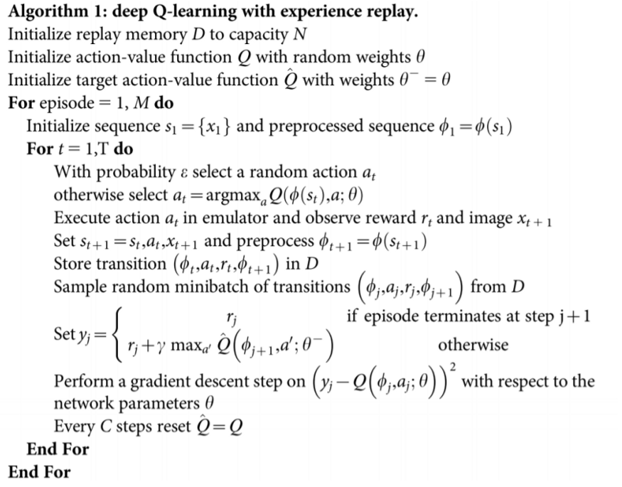
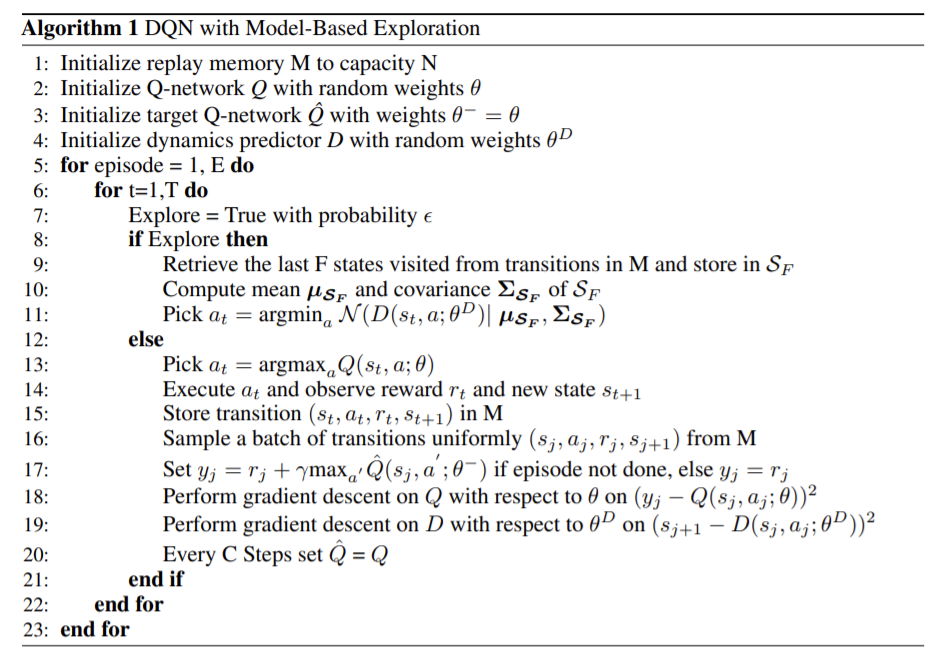
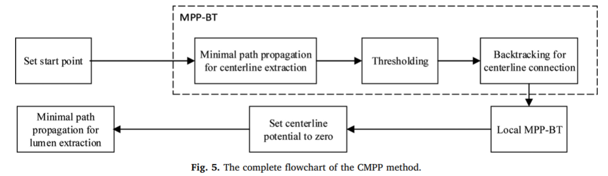

# Literature review

[Website that lists the performance of each Rainbow addition + source code](https://pytorch-lightning-bolts.readthedocs.io/en/0.2.4/reinforce_learn.html)

TO READ : 

- [Sample efficient RL algorithm (Microsoft)](https://www.microsoft.com/en-us/research/publication/provably-efficient-rl-with-rich-observations-via-latent-state-decoding/)

### Introduction on RL

Reinforcement Learning (RL) is a learning methodology by which the learner learns to behave in an interactive environment using its own actions and rewards for its actions. The learner, often called, agent, discovers which actions give the maximum reward by exploiting and exploring them.

The basic elements of a reinforcement learning problem are:

- Environment: The outside world with which the agent interacts
- State: Current situation of the agent
- Reward: Numerical feedback signal from the environment
- Policy: Method to map the agent’s state to actions. A policy is used to select an action at a given state
- Value: Future reward (delayed reward) that an agent would receive by taking an action in a given state

Throughout this process, it is the agent's goal to maximize the total amount of rewards that it receives from taking actions in given states. This means that the agent wants to maximize not just the immediate reward, but the cumulative rewards it receives over time.

Questions:

How probable is it for an agent to select any action from a given state ? => Policies

How good is any given action or any given state for an agent ? => Value functions

In terms of return, a policy $\pi$ is considered to be better than or the same as policy $\pi'$ if the expected return of $\pi$ is greater than or equal to the expected return of $\pi'$ for all states.

*Bellman optimality equation* : for any state-action pair $(s,a)$ at time $t$, the expected return from starting in state $s$, selecting action $a$ and following the optimal policy thereafter (AKA the Q-value of this pair) is going to be the expected reward we get from taking action $a$ in state $s$, which is $R_{t+1}$, plus the maximum expected discounted return that can be achieved from any possible next state-action pair $(s',a')$. 

The *Bellman equation* is used to update the Q-value for each state-action pair, and according to the learning rate.

The formula for calculating the new Q-value for state-action pair $(s,a)$ at time $t$ is this ($\alpha$ : learning rate, $\gamma$ : discount rate):

$`q^{new}(s,a) = (1-\alpha) q(s,a) + \alpha (R_{t+1}+\gamma \max_{a'}q(s',a'))`$

Scheme of RL training loop : 

Experience Replay is a replay memory technique used in reinforcement learning where we store the agent’s experiences at each time-step, pooled over many episodes into a replay memory. We then usually sample the memory randomly for a minibatch of experience, and use this to learn off-policy, as with Deep Q-Networks. 

[*Model-free* vs *model-based* RL](https://analyticsindiamag.com/what-is-model-free-reinforcement-learning/) difference is explained in the hyperlink. [This](https://ai.stackexchange.com/questions/4456/whats-the-difference-between-model-free-and-model-based-reinforcement-learning/6733) might even be clearer. It's not because an algorithm uses a model that it is model-based. An algorithm is *model-free* when it does not use a prediction on the next reward or state of the environment as part of the calculation of the next optimal action. 

Difference between Q-learning (model-free) and Deep Q-network (also model-free, can be model-based, e.g. model-based exploration) : 
The difference is that you have replaced an exact value function with a function approximator. With Q-learning you are updating exactly one state/action value at each timestep, whereas with DQN you are updating many. The problem this causes is that you can affect the action values for the very next state you will be in instead of guaranteeing them to be stable as they are in Q-learning. Using a target network as an error measure is then more stable. The target network does not update every step, leaving the network with more time to consider actions that have taken place before you use it to start making actions. In DQN we train a NN that approximates the Q-function (which estimates the return we would get given any pair of action and state), whereas for Q-learning we simply evaluate for the pair of state and action that we experience.
The following link explains [why a target network is required for stability of DQN](https://stackoverflow.com/questions/54237327/why-is-a-target-network-required).

In DQN : a network is trained to learn a Q-function (a policy) that is able to evaluate the return for any action given a state (given a state (can be continuous), the net outputs a number for each possible action, and we then perform the action corresponding to the index with the max value in a greedy manner).

[Playlist for videos on RL](https://www.youtube.com/playlist?list=PLAdk-EyP1ND8MqJEJnSvaoUShrAWYe51U)

Example of a modification of this algorithm to make DQN *model-based*, by using a model for the *exploration* and not just taking a random action. Here the dynamic predictor $D$ is a neural network that predicts the next state given the current state and an action. It tries to help with the sample inefficiency of DQN in the case of very sparse rewards.

**Discount factor $\gamma$** : the discount factor (normally $0 < \gamma \leq 1$) essentially determines how much the reinforcement learning agents cares about rewards in the distant future relative to those in the immediate future. If $\gamma = 0$, the agent will be completely myopic and only learn about actions that produce an immediate reward. If $\gamma = 1$, the agent will evaluate each of its actions based on the sum total of all of its future rewards.
Longer time horizons have have much more variance as they include more irrelevant information, while short time horizons are biased towards only short-term gains, hence the importance of not picking a too high $\gamma$ or a too small one.

[How to pick the discount factor](https://stats.stackexchange.com/questions/221402/understanding-the-role-of-the-discount-factor-in-reinforcement-learning) : $\gamma = e^{-1/\tau}$ with $\tau$ representing the time horizon. You should generally pick a discount factor such that the time horizon contains all of the relevant rewards for a particular action but not any more.

**Q-learning vs Policy gradient** : two major approaches for RL algorithms
- Q-learning : learns Q-function (from Bellman equation), policy comes from Q-function => we greedily select action with maximum value. Q-learning also uses experiences collected from previous policies to determine update the policy => ***off-policy***.
- Policy gradient : directly try to maximize the expected return by following policy gradient => derivative of the expected return w.r.t the policy parameters. Policy gradient is derived as an expectation over trajectories, and to get an unbiased estimate of the gradient, the trajectories have to be sampled from the most recent version of the policy => ***on-policy***. More stably converge to a good behavior than Q-learning, but more sample inefficient ! Policy gradients can learn stochastic policies while value functions can't. Policy gradients : more effective in high dimensional action spaces. No need for exploration/exploitation trade-off as dealing with probability distribution over actions. BUT : a lot of the time, it converges to a local maximum rather than the global. Problem with policy gradient : if we compute a high reward, we conclude that all actions we took were good, even if some were bad (all actions averages as good because the total reward was important) => lots of samples needed for an optimal policy.

$\rarr$ Definition of a trajectory $\tau$ : $\tau = (s_{0}, a_{0}, ..., s_{T}, a_{T}) \rarr$ a sequence of states and actions. The goal is then to maximize the reward, by finding the right trajectories. 

It is common for ML practitioners to interpret a loss function as a useful signal during training—”if the loss goes down, all is well.” In policy gradients, this intuition is wrong, and you should only care about average return. The loss function means nothing.

- Actor Critic :

Hybrid of policy gradient and value-based function methods, two NNs a *Critic* measuring how good the action taken is (value-based) and an *Actor* controlling how the agent behaves (policy-based). Improvement of the score function of the policy-based methods. Instead of waiting until the end of the episode as we do in *Monte Carlo REINFORCE* => update at each step (TD Learning). Both NNs trained *IN PARALLEL* with $s_{t}$ the state at time $t$. Critic => value $Q$, Actor => policy $\pi$.

After doing a step => we get a state $s{t+1}$ and a reward $R{t+1}$. The *Critic* computes $Q$-value of taking that action at that state => *Actor* updates policy parameters using $Q$-value. Then, *Actor* produces next action $a{t+1}$ and *Critic* updates its value parameters...

- **A2C** : Advantage Actor Critic, introducing an advantage function (similar to Dueling DQN) to reduce the variability and stabilize learning. The advantage function $A(s,a) = Q(s,a) - V(s)$ will tell us the improvement the action taken at that state caused as compared to the average. => requires two value functions, but the TD error is a good estimator of the advantage function. A2C is synchronous. Different agents in parallel, we wait until the all have finished training and calculated their gradients to average them and update our global network.

Ex : Sonic the Hedgehog, build multiple instances of environment (different levels) to avoid overfitting => create a vector of n environments to run them simultaneously.

- **A3C** : Asynchronous A2C, asynchronously execute different agents in parallel on multiple instances of the environment. Each copy of the network will update the global network asynchronously

- PPO  (Proximal Policy Optimization) : able to beat world-class players on Dota2. Goal : avoid too large policy update, using a ration telling the difference between new and old policy and clip ration from 0.8 to 1.2. + running K epochs of gradient descent over a sampling mini batches to train the agent. It improves the stability of the Actor training by limiting the policy update at each training step by introducing a new objective function : Clipped Surrogate Objective function. PPO clips probability ratio directly inside the objective function.

- TRPO : Trust Region Policy Optimization, uses KL divergence constraints outside of the objective function to constraint the policy update. But : this method is more complicated to implement and it takes more computation time than PPO.

Loss functions and DQN : [which one](https://www.reddit.com/r/MachineLearning/comments/6dmzdy/d_on_using_huber_loss_in_deep_qlearning/) to pick (for example between MSE, MAE and Huber loss). MSE is penalizing more the outliers (squared term) as compared to Huber and MAE. Huber is squared at errors below some threshold (typically 1) :

Huber loss is often only used with reward clipping \[-1,1\], and converges to the correct mean solution when clipped. Choice of $\delta$ for Huber loss is critical, it reflects what we're willing to consider as an outlier and what we're not. Residuals > $\delta$ will be minimized with L1 (MAE) while residuals < $\delta$ will be minimized with L2. Huber loss is useful if your observed rewards are corrupted occasionally (if you erroneously receive unrealistically large positive/negative rewards in your training environment).

## Applications

### 1. RoadTracer: Automatic Extraction of Road Networks from Aerial Images (2018)

- Goal : infer network => extract graph connectivity from image
- Before : CNNs for pixel segmentation, then complex algo to infer graph. But : CNN output is noisy, lots of misclassified pixels in segmentation => high error rate for network extraction.
- RoadTracer : automatically construct road network. Uses CNN-based decision function to derive network from output of CNN. Iterative graph construction process for extracting graph structure from images. Adding road segments one at a time.
- Difficult because occlusion by trees, etc. 
- RoadTracer : no intermediate image of road network. Novel CNN architecture deciding on next segment of road with portion of already constructed network as input.
- Standard approaches using static set of labeled training examples => not GOOD. Instead : procude training examples on the fly as the CNN evolves during training. => Close to RL but used in an efficient supervised training procedure.
- Code available <a href="https://github.com/mitroadmaps/roadtracer/">here</a> and details about the project <a href="https://roadmaps.csail.mit.edu/roadtracer/">here</a>.
- Before : to extract network from CNN segmentation (Cheng et al.) (just a probability BG or ROAD for each pixel) => thresholding + morphological thinning => road centerlines => graph after tracing centerlines. Not doing well when uncertainty in segmentation (e.g. occlusion, ambiguity, ...). 
- (Hu et al.) Extract graph from road without prior segmentation of pixels. Involve numerous heuristics and assumptions. 
- Goal : infer graph => vertices annotated with spatial coordinates + edges = road segments. Derive graph directly from CNN. Iterative graph construction. Search algorithm guided by decision function based on CNN. Starts on location known to be on road network (initial point).
- Before (state-of-the-art) : segmentation-based approach in 2 steps : (1) binary segmentation (2) post-processing step with set of heuristics to convert into network graph. The graph is then simplified with the <em>Douglas-Peucker</em> method. 
- (Check <em>Iterative Graph Construction</em> algorithm in article).
- CNN decision function (decision to continue the road up/left/etc or STOP). Input layer : window centered on vertex, 4 channels (RGB + portion of graph constructed so far contained in the window). Including already computed graph is ESSENTIAL => to exclude those roads + use it to deal with occlusion by trees/building. Output layer, two components : action (walking or stopping) + angle to walk in. Softmax to both to decide which to pick.
- CNN training : use partial graph as input and ground truth maps. <b>Static training dataset</b> => bad performance, perfect loss on training examples, bad at inference due to wrong angles and not being able to rectify. Snow ball effect. <b>Dynamic labels</b> => run the search algorithm <b>during</b> training + generate new training examples as the CNN model evolves. CNN to decide action based on output layer + we determine the action that an oracle would take, and train the CNN to learn that action. <b>Difference</b> : parameters are updated based on CNN output and not on oracle output.
- Training set : 25 cities, testing set : 15 (different) cities, not other regions of the same cities.
- New evalutation metrics based on two things (for accuracy of graph) : (1) give a score representative of the inferred map's practical usability (2) to be interpretable. Junction-by-junction comparison (vertices with >3 edges).

### 2. Deep Reinforcement Learning for Vessel Centerline Tracing in Multi-modality 3D Volumes (2018)

- Vessel centerline tracing using RL, 3D medical images. Useful for improved measurement of diameter and lengths of vessels. Learn an artificial agent to interact with environment and collect rewards from interaction. A deep NN is integrated to predicted stepwise action value for every possible action. Fast and accurate detection.
- Challenges : (1) occupy small fractions of images (2) vessel boundaries are obscure (3) changing cross-section area (4) lengthy so hard to trace
- State-of-the-art : searching shortest path satisfying cost metrics (Hessian based vesselness) => can take shortcuts. Deep Learning models perform better but computationally heavy. 
- Here : DRL (deep RL) network. Shortest path computation method not required anymore. Artifical agent also learns when to stop. Can be applied to tracing other vessels than aorta (general method). 
- Introduction on RL. Inspired on human behavior, take decisions based on previous experiences. Two subproblems : (1) evaluation policy problem to compute the state and the action functions (2) control problem to search for the optimal policy.
- <b>Good introduction on RL + transition from using it for games to using it on medical images</b>
- On CT scans (contrasted + non-contrasted) + MR volumes (Magnetic Resonance). Intensities of all images are made equally bright. Clip + normalise voxel intensities within [500, 2000]. Mix all images. Partition of train/test set with 3:1 ratio on each image type.
- Approximator for the optimal <b>action-value</b> function : multi-layer NN. (Hidden layer 1) conv layer with 32 filters of size 4x4x4 and stride 2 + batch normalisation + ReLU. (Hidden layer 2) conv layer with 46 filters of size 3x3x3 and stride 2. (Hidden layer 3 and 4) two fully-connected layers with 256 and 128 units. (Final layer) fully-conn with 6 possible outputs. 
- To avoid early over-fitting and make the model robust : train in episodic manner, start from one volume, then accumulate samples in experience replay set.
- $\epsilon$-greedy technique => to favor exploration in early epochs over exploitation according to the policy.
- Parameters for the NN : batch size : 8, learning rate : 0.0005, forward offset k : 1, $\alpha$ : 0.8, $\lambda$ : 0.5, $\gamma$ : 0.9, $\eta$ : 0.5.
- RL model : sequential decision making problem, reward-based Markov Decision Process (MDP). 
- At each time *t*, agent receives state *s* from state space *S* and selects action *a* from action space *A* according to policy $\pi$. Action space *A* : {*left, right, bottom, up, front, back*}. A reward is attributed based on the effect of the transition from state *s* to *s'*. 
- Step-wise reward *r* computed differently in two cases : (1) current agent position is far from curve => we want the agent to approach the curve as quickly as possible (2) near the curve => we want it to move along the curve. 
- Long-term expected return *R* => way to aggregate the cumulative rewards into one term that we wish to maximise (role of the agent).

### 3. Playing Atari with Deep Reinforcement Learning (2013)

- Using $s_{t} = x_{1}, a_{1}, x_{2}, a_{2}, ..., x_{t-1}, a_{t-1}$.
- Iteration algorithm that converges to the optimal action-value function $Q_{i} \rarr Q^{*}$ as $i \rarr \infty$
- Uses Q-learning algorithm. Q-learning is *model-free* : is solves the RL task directly using samples from the emulator, without explicitly constructing an estimate of it, and *off-policy* : only picks the action with highest action-value (exploration still picked at random rate).
- Here, CNN to estimate the environment $\Epsilon$ $\rarr$ so it's a combination of deep learning and RL.
- Stochastic gradient descent to help with the very large dataset here.
- RPROP algorithm to update the parameters of the Q-network (resilient back-propagation, only uses the sign of the gradient, not the magnitude) 
- TD-gammon : backgammon playing programm based on RL, first one to work amazingly well. Probably due to stochasticity of throwing a dice (as opposed to chess, which did not work so well).
- Using *experience replay* : where we store the past agent's experiences at each time-step, pooled over many episodes into a *replay memory*. 
- Algorithm proposed here : *Deep Q-learning* (with experience replay)
- Pre-processing on images as 210x160 pixels at 60Hz and RGB. Convert to grayscale + down-sampling to 110x84 + cropping to playing area (square input required from previous implementation).
- NN : (input) 84x84x4 image from pre-processing (4 last frames are used), (1st hidden) conv 16 8x8 filters stride 4 + ReLU, (2nd hidden) 32 4x4 filters stride 2 + ReLU, (final hidden) fully-conn 256 units, (output) fully-conn with as many outputs as the number of actions (depends on the game, from 4 to 18 possible actions).
- Trained on 10 million frames, replay memory of one million most recent frames.
- Frame-skipping, only select action on every $k^{th}$ action and apply to the other skipped frames ($k=4$ here).
- Hard to measure reward during training.

### 4. Simple Statistical Gradient-Following Algorithms for Connectionist Reinforcement Learning (1992)

Very math-oriented paper commenting on the convergence to not necessarily optimal local maximum of Gaussian units or REINFORCE models. The main disadvantage of REINFORCE algorithms are the lack of a general convergence theory applicable to their class and, as with all gradient algorithms, an apparnet susceptibility to converge to false optima.

- RL performance criterion (performance measure to optimize) : expected value of the reinforcement signal (reward or punishment), conditioned on a particular choice of parameters of the learning system $\rarr \Epsilon\{r|W\}$, with $W$ the network's weight matrix and $r$ the reinforcement signal.
- REINFORCE algorithm : any learning algorithm having : $\Delta w_{i,j} = \alpha_{i,j}(r-b_{i,j})e_{i,j}$
- Episodic REINFORCE algorithm : same but the characteristic elligibility varies over time $\Delta w_{i,j} = \alpha_{i,j}(r-b_{i,j}) \sum_{t=1}^k e_{i,j}(t)$. The appropriate performance measure becomes  $\Epsilon\{\sum_{t=1}^k r(t)|W\}$
- Characterstic elligibility : $\frac{\partial \Epsilon\{r|W\}}{\partial w_{i,j}}$ which is $\frac{\partial ln(g)}{\partial \mu} = \frac{y - \mu}{\sigma^{2}}$ for $\mu$ in the case of a Gaussian unit.
- Compatibility with Backpropagation
- Choice of adaptive baseline #b# has a positive influence on the convergence speed + on the qualitative output of the model. What $b$ to choose is hard to decide though.

### 5. (WEBSITE) The Reinforce Algorithm aka Monte-Carlo Policy Differentiation

- Monte-Carlo estimation is way to turn an expectation into a summation by approximating it :

$\lim_{N \to \infty} \frac{1}{N}\sum_{i=1}^N f(x_i)_{x_i \sim p(x)} = \mathbb{E}[f(x)]$

- Monte-Carlo approximation to estimate the objective function $J(\theta)$ (which when maximized, represents the optimal policy $\pi_{\theta^{*}}$):

$J(\theta) \approx \frac{1}{N} \sum_{i=1}^N \sum_{t} r(s_{i, t}, a_{i, t})$

- We want to find $\theta^{*} = argmax J(\theta)$
- As it's the max $\rarr$ gradient ascent
- Explanation of how the gradient is computed

With $r(\tau) = \sum_{t} r(s_t, a_t)$, we can write : $J(\theta) = \mathbb{E}_{\tau \sim \pi_\theta(\tau)}[r(\tau)]
= \int \pi_\theta(\tau) r(\tau)\ d\tau$

- Gradient of $J : \nabla_\theta J(\theta) = \int \nabla_\theta \pi_\theta(\tau)r(\tau)\ d\tau$

- Substitution : $\nabla_\theta \pi_\theta(\tau) = \pi_\theta 
\frac{\nabla_\theta \pi_\theta(\tau)}{\pi_\theta(\tau)}
= \pi_\theta(\tau) \nabla_\theta \log{\pi_\theta(\tau)}$ and $\pi_\theta(\tau = s_1, a_1, \ldots, s_T, a_T)
= p(s_1) \prod_{t=1}^T \pi_\theta (a_t \mid s_t) p(s_{t+1} 
\mid s_t, a_t)$

- Using another **Monte-Carlo** approximation to get rid of the other expectation rising from the integral, we get for the gradient of $J : \nabla_\theta J(\theta) \approx \frac{1}{N} \sum_{i=1}^N \left[ \left(\sum_{t} \nabla_\theta \log{\pi_\theta}(a_{i, t} \mid s_{i,t})\right) \left(\sum_t r(s_{i,t}, a_{i,t})\right)\right]$

- Adding the update rule ($\theta \leftarrow \theta + \alpha \nabla_\theta J(\theta)$), we get the following **REINFORCE ALGORITHM** :

1) Sample trajectories $\{\tau_i\}_{i=1}^N from \pi_{\theta}(a_t \mid s_t)$ by running the policy.
2) Set $\nabla_\theta J(\theta) = \sum_i (\sum_t \nabla_\theta \log \pi_\theta(a^i_t \mid s^i_t)) (\sum_t r(s^i_t, a^i_t))$
3) Update with (gradient ascent) : $\theta \leftarrow \theta + \alpha \nabla_\theta J(\theta)$ by picking a learning rate 

### 6. (WEBSITE) The Problem with Policy Gradient

- Policy update rule not working well in practice

1) Policy gradient is terribly sample inefficient :

*On-policy* algorithm as we're sampling directly from the policy we're optimizing. In order to get anything useful out of policy gradient, it's necessary to sample from your policy and observe the resultant reward literally millions of times.

2) Convergence in policy gradient algorithms is slow :

 Having to sample entire trajectories on-policy before each gradient update is slow to begin with, and the high variance in the updates makes the search optimization highly inefficient which means more sampling which means more updates, etc.

3) Policy gradient is high variance :

When we're sampling multiple trajectories from our untrained policy we're bound to observe highly variable behaviors. As we train the model we hope to shape the probability density so that it's unimodal on a single action, or possibly multimodal over a few successful actions that can be taken in that state. However, acquiring this knowledge requires our model to observe the outcomes of many different actions taken in many different states. This is made exponentially worse in continuous action or state spaces as visiting even close to every state-action pair is computationally intractable. Due to the fact that we're using Monte Carlo estimates in policy gradient, we trade off between computational feasibility and gradient accuracy. It's a fine line to walk, which is why variance reduction techniques can potentially yield huge payoffs.

- Improvements to policy gradient (reduce variance) :

1. Change the gradient approximation by only considering the rewards "to go", as we consider that actions taken at time $t$ can only influence future rewards. The gradient becomes :

$\nabla_\theta J(\theta) = \frac{1}{N} \sum_{i=1}^N \left[ \left(\sum_{t=1}^T \nabla_\theta \log{\pi_\theta}(a_t \mid s_t)\right) \left(\sum_{t=t'}^T r(s_{t'}, a_{t'})\right)\right]$

2. Add a baseline $b$ to have positive return $r(\tau) = \sum_{t} r(s_t, a_t) + b$ (and no negative, but just shifted in the positive). A natural candidate for $b$ would be the average reward $b = \frac{1}{N} \sum_{i=1}^N r(\tau_i)$ over all trajectories. But not optimal. If we set $\frac{dVar}{db} = 0$, we get : $b = \frac{\mathbb{E}[g(\tau)^2r(\tau)]}{\mathbb{E}[g(\tau)^2]}$, which means the optimal $b$  is to take the expected reward but reweight it by expected gradient magnitudes ($g(\tau) = \nabla \log \pi_\theta(\tau)$).

### 7. Q-Learning (1992)

Proof of a convergence theorem for Q-learning. Q-learning converges to the optimum action-values with probability 1 so long as all actions are repeatedly sampled in all states and the action-values are represented discretely.

- The optimal action is obtained when the maximum is attained for the Q-value. Meaning that if the Q-values can be learned, it is valid to deduce the action from the maximum value of the Q-values.
- The Q\*-values are unique
- In Q-learning : agent's experience consists in sequence of N episodes
In the $n^{th}$ episode, the agent :
1. observes current state $x_n$
2. selects and performs action $a_n$
3. observes next state $y_n$
4. receives immediate payoff $r_n$
5. adjusts its $Q_{n-1}$ values using a learning factor $\alpha_n$

- Table representation for $Q_n(x,a)$
- Convergence theorem : 

Given bounded rewards $|r_n| \leq R$ and $0 \leq \alpha_n < 1$, then $Q_n(x,a) \rarr Q^{*}(x,a)$ as $n \rarr \infty$

### 8. Rainbow: Combining Improvements in Deep Reinforcement Learning (2017)

Testing extensions to DQN algorithm and combining them $\rarr$ benchmark on Atari 2600. Shows contribution of each component to overall performance.

1. DQN : Deep Q-Networks algorithm, combination of Q-learning and CNN. Experience replay enabled it to learn, from raw pixels, how to play Atari games at human-level performance. 
2. DDQN : double DQN $\rarr$ deals with overestimation bias of DQN by decoupling selection and evaluation of bootstrap action. Using the online network to select the best action (by taking argmax) and the target network to get the value estimate => less biased.
3. Prioritized (Prioritized DDQN) : prioritized experience replay, improves data efficiency by sampling more often from the replay memory transitions from which there is more to learn.
4. Dueling (DDQN) : separately  representing state values and action advantages, helps generalization across actions. Scheme of the neural network :

5. A3C : multi-step bootstrap targets $\rarr$ shifts bias-variance trade-off and helps propagate newly observed rewards faster to earlier visited states. Leads to faster learning.
6. Distributional DQN : learns categorical distribution of discounted returns, instead of estimating the expected return (the mean).
7. Noisy DQN : uses stochastic network layers for exploration. No exploration with $\epsilon$-greedy policies. Change in the layer equation of the network $y = Wx + b$ by introducing some noise. Over time, the network can learn to ignore the noisy stream, **at different rates in different parts of the state space** $\rarr$ allowing state-conditional exploration (*i.e.* only exploration in certain areas of the screen)

Performance across 57 Atari games of each algorithm :

- Rainbow doing better than DQN after only 7M frames and better than all others after 44M frames (overall, not for all games separately).
- Rainbow combines them all (some have already been combined in the past).
- \+ Ablation studies provided (removing some components) to understand contribution of each component.
- To measure the overfitting : two different start for the games (1) *no-op starts* a random number < 30 of no-op actions at the beginning (2) starts with points randomly sampled from the initial portion of human expert trajectories.
- DQN and its variants DO NOT perform learning updates during the first 200K frames (except for prioritized replay, which can start after only 80K)
- DQN starts with $\epsilon$ of 1 to final value of 0.1 (after 400K frames). For Noisy DQN which has $\epsilon$ = 0 and acts fully greedily. For the rest of the nets : $\epsilon$ from 1 to 0.01 after 250K frames.
- Adam optimizer ($\epsilon = 1.5$ x $10^{-4}$). Less sensitive to choice of learning rate than RMSProp.
- Learning rate : DQN : $\alpha$ of 0.00025, Rainbow : $\alpha/4$
- Hyper-parameters are the **same** for all games !

Recap of Rainbow hyperparameters : 

- Prioritized replay and multi-step learning were the two most crucial components of Rainbow, in that removing either component caused a large drop in median performance. 
- No significant difference when removing the dueling network from the full Rainbow

### 9. DeepVesselNet: Vessel Segmentation, Centerline Prediction, and Bifurcation Detection in 3-D Angiographic Volumes (2020)

- X-Ray for blood vessels (angiography)
- High power requirements for 3D CNN + low speed. Few labelled training data. 

3 steps of the paper :
1. 2D orthogonal cross-hair filters => 3D information with less power. (23% improvement in speed, comparable accuracy, lower network complexity = good against overfitting)
2. New loss : class balancing cross-entropy loss with false positive rate correction to handle high class imbalance. 
3. Generation of synthetic data to build vascular trees under constraints on local network structure + use the new data for transfer learning. (Efficient + robust and excels in other angiography segmentation tasks)
- **Sub-sampling** + **max-pooling** layers leading to drop in performance

1. **Fast cross-hair filters** :
- Not slice-wise as would discard 3D information that is crucial for tracking curvilinear 3D structures => intersecting 2D planes
- Sum contribution of many 2D filters in the 3 directions after the convolution
- Lowering memory requirements by keeping same voxel in memory and rotating kernels instead of doing neighboring voxels on after another. Same training with lower memory. 
- Difference in performance as compared to 2.5D networks (cumulate parallel 2D slices) : same scaling as the cross-hair filters with respect to volume size and to the kernel size. No post- or pre-processing needed with crosshair as compared to 2.5D. 

2. **Extrem class balancing** :

**BACKGROUND CLASS IS 1, VESSEL CLASS IS 0 HERE** $\rarr$ False positives represent the vessel voxels that were classified as background. 

- Vessels account for < 3% of the total voxels in the volume => high class imbalance + centerlines account for a fraction of the segmented vessels.
- Bias towards background class (common in medical data).
- Current class balancing loss functions for training CNNs are numerically unstable in the case of this paper => not usable.
- Balanced loss function by multiplying each class term in the loss computation
- BUT : (1) previous loss functions are numerically unstable with big training data (big batch size) (gradient take high values) => important to scale the loss to the mean value (2) high false positive rate leading to high recall values during training and during testing.
- New extreme class balancing loss : scale by the total number of false positive and false negative predictions + scaling of the two in order to penalize false positives. 

3. **Transfer learning from synthetic data** :
- Simulation based generation of synthetic data
- Used in pre-training of network => later training of supervised classifier easier
- Transfer learning from pre-trained. Essential for performance in various angiography tasks. 
- Using physiological laws to build plausible trees built out of tubes of certain radius and lengths.
- Different background and foreground intensity patterns are tried with various signal-to-noise ratios.
- Produces an already labelled (vessels, centerlines and bifurcations !) 3D datasets of vascular structures, which is crucial for CNN training, and with a significant amount of data.
- Gaussian noise is applied
- 136 volumes of size 325x304x600 are generated (amongst which 20 are used for testing)

Prior work :

- Vessel segmentation : (1) vessel enhancement filters (Hessian or Optimally Oriented Flux OOF), not leading to significant improvement (2) Deep NN to segment neurons by pixel classification
- No deep learning network architecture already publicly available
- Centerline prediction : post-processing such as erosion, active contour models, estimation of centerline of tubular structures as path with minimal cost, vesselness filters to predict location of centerlines, Hough transform. Deep learning has not been explored (lack of annotated data, especially in 3D).
- Bifurcation detection : detection of tree nodes => important for network extraction. Often by post-processing of segmentation. Direct prediction of bifurcation without prior segmentation not attempted yet. 

- Dataset 1 : 20 annotated human MRA volumes + 20 partially annotated. Fully annotated : 15 for testing + 5 for validation
- Dataset 2 : 20 non-overlapping volumes of CT of rat brain 

- Network : DeepVesselNet-FCN (fully convolutional) without down-sampling and up-sampling as the task involves fine detailed voxel sized objects and down-sampling has an effect of averaging over voxels. Python implementation available [here](https://github.com/giesekow/deepvesselnet) for public use. 
- DeepVesselNet-**VNet** and -**UNet** also tried (both include down-sampling, so useful to compare with the FCN). 
- Pre-training : learning rate : 0.01, decay : 0.99 applied after every 200 iterations
- Finetuning : learning rate : 0.001, decay : 0.99 applied after every 200 iterations
- Training : SGD without regularization
- Speed compared between VNet, UNet which are originally not using crosshair filters but 3D filters => speed up of 23%

- Results :
1. Segmentation : FCN best
2. Centerline prediction : FCN best
3. Bifurcation detection : FCN best
- Detection of centerlines + bifurcations works better in smaller vessels (those of large vessels are not detected) => could be due to the network seeing more smaller vessels during training. Can be addressed by sampling more examples fr om bigger vessels to balance the training data.

### 10. Vessel Structure Extraction using Constrained Minimal Path Propagation (2020)

- Minimal path method efficient for extraction of vascular structures in medical imaging. Previous method : MPP-BT (minimal path propagation with backtracking)
- Novel method here : CMPP (constrained MPP) + local MPP-BT to handle structure missing caused by close-loop problem (in 2D images)
- Unsupervised with only one start point required
- First tried in 2D and then extended to 3D data
- State-of-the-art for vessel extraction : 
1. filter-based algorithms => vascular enhancement (Hessian filter or Frangi filter) and then segmentation, BUT : very high computational time in large images.
2. model-based algorithms => active contour models, working well but sensitive to initialization + image matting model.
3. supervised algorithms => hand-crafted labels required, so limited.
4. centerline-tracking algorithms => first extract centerlines using minimal path tracking, then dilation of centerlines to acquire vessel areas. Able to overcome vessel crossing, intensity or width variations.

- MPP-BT not offering solution to the extraction of vessel lumen => CMPP completes this task + also adds a local MPP-BT operation to solve the close-loop problem.
- Advantages : (1) unsupervised (2) not sensitive to initialization (3) faster than filter-based algorithms
- Backtracking to overcome **end problem**, **shortcut problem** and **accumulation problem**.

Complete flowchart of the CMPP method :

After running the MPP-BT once, it is run once again using the previous breakpoints as starting points.

- Local MPP-BT still useful in 3D even though close-loops are not an issue anymore, as a single MPP-BT is sometimes unable to extract centerline points at vessel endings. Local MPP-BT can extend centerlines to make them more complete
- Data : manually segmented 3D vessel tree (256x256x256) projected onto a 256x256 2D background image
- GROUND and STARE databases provide ground truth vessel extraction.
- Quantitative evaluation using 3D synthetic images from VascuSynth dataset.
- Performance metrics : accuracy, sensitivity, specificity

